     <h1>Hi 👋, I'm Aaradhy Srivastava</h1> <h3>DevOps Engineer • Cloud • Automation • Kubernetes</h3> 
  
 

👨‍💻 About Me

🌱 Currently learning DevOps, AWS, Jenkins, Ansible and cloud technologies

💬 Ask me about AWS, Docker and Kubernetes

🔧 Interested in automation, CI/CD, cloud infrastructure and containers

📫 Reach me at srivastavaaaradhy02@gmail.com

🔗 Connect With Me

  

🛠️ Languages & Tools

               

📊 GitHub Stats

  
 
  

⚡ Keep Building. Keep Automating. Keep Learning.

